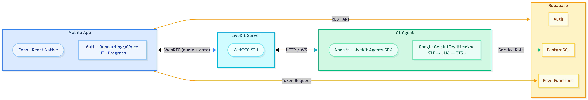

# SpeakEasy AI — Real-time English Learning Assistant

AI-powered voice conversation partner for non-native English speakers. Practice pronunciation, grammar, vocabulary, and fluency through real-time voice conversations with an AI teacher.

## Architecture



## Tech Stack

| Layer | Technology |
|-------|-----------|
| Mobile App | Expo SDK 54, React Native, TypeScript, Expo Router |
| State Management | Zustand |
| Voice Infrastructure | LiveKit (self-hosted via Docker) |
| AI Agent | LiveKit Agents SDK (Node.js), Deepgram STT, OpenAI GPT-4.1, Cartesia TTS |
| Backend/Auth | Supabase (Auth, PostgreSQL, Edge Functions) |
| Monorepo | pnpm workspaces |

## Project Structure

```
speakeasy-ai/
├── mobile/                   # Expo React Native app
│   ├── app/                  # Expo Router screens
│   │   ├── (auth)/           # Welcome, Login, Register
│   │   ├── (onboarding)/     # Language, Level, Goals, Topics
│   │   └── (main)/           # Tabs: Home, History, Progress, Profile
│   ├── src/
│   │   ├── components/ui/    # Button, Card, Input, ScreenWrapper
│   │   ├── services/         # Supabase client, auth, LiveKit token
│   │   ├── stores/           # Zustand (auth, profile, conversation)
│   │   ├── types/            # TypeScript types for DB tables
│   │   └── utils/            # Constants, CEFR levels, formatters
│   └── package.json
│
├── agent/                    # LiveKit Agent (Node.js)
│   ├── src/
│   │   ├── agent.ts          # Main entry (defineAgent, voice pipeline)
│   │   ├── tools/            # Grammar, pronunciation, vocabulary tools
│   │   ├── prompts/          # System prompt builder
│   │   └── services/         # Supabase client (server-side)
│   └── package.json
│
├── supabase/
│   ├── migrations/           # SQL schema + RLS policies
│   └── functions/            # Edge Functions (livekit-token)
│
├── docker/
│   ├── docker-compose.yml    # LiveKit Server + Redis
│   └── livekit.yaml          # LiveKit config
│
├── package.json              # Root workspace scripts
└── pnpm-workspace.yaml
```

## Prerequisites

- **Node.js** >= 20
- **pnpm** (`npm install -g pnpm`)
- **Docker** & Docker Compose
- **Supabase CLI** (`npm install -g supabase`)
- **Expo CLI** (`npm install -g expo-cli`)
- **Xcode** (iOS) or **Android Studio** (Android) for dev builds
- An **OpenAI API key** (for the agent LLM — used via LiveKit Inference or direct plugin)

## Setup Guide

### 1. Clone & Install Dependencies

```bash
git clone <repo-url> speakeasy-ai
cd speakeasy-ai
pnpm install
```

### 2. Start LiveKit Server (Docker)

```bash
# Start LiveKit + Redis containers
pnpm dev:livekit

# Verify it's running
curl http://localhost:7880
```

LiveKit will be available at `ws://localhost:7880` with credentials:
- **API Key:** `devkey`
- **API Secret:** `secret`

To stop:

```bash
pnpm stop:livekit
```

### 3. Set Up Supabase

#### Option A: Local Supabase (recommended for development)

```bash
# Start local Supabase stack
supabase init
supabase start
```

This gives you a local Supabase instance. Note the **API URL**, **anon key**, and **service_role key** from the output.

#### Option B: Hosted Supabase

1. Create a project at [supabase.com](https://supabase.com)
2. Note your project URL and keys from Settings → API

#### Run the database migration

```bash
# If using local Supabase:
supabase db reset

# If using hosted Supabase:
# Copy the contents of supabase/migrations/001_initial_schema.sql
# and run it in the Supabase SQL Editor
```

#### Deploy the Edge Function (hosted Supabase only)

```bash
supabase functions deploy livekit-token
supabase secrets set LIVEKIT_API_KEY=devkey LIVEKIT_API_SECRET=secret LIVEKIT_URL=ws://YOUR_HOST:7880
```

### 4. Configure Environment Variables

#### Mobile app

```bash
cp mobile/.env.example mobile/.env
```

Edit `mobile/.env`:

```bash
EXPO_PUBLIC_SUPABASE_URL=http://localhost:54321      # local Supabase API URL
EXPO_PUBLIC_SUPABASE_ANON_KEY=your-anon-key          # from supabase start output
```

#### Agent backend

```bash
cp agent/.env.example agent/.env.local
```

Edit `agent/.env.local`:

```bash
LIVEKIT_API_KEY=devkey
LIVEKIT_API_SECRET=secret
LIVEKIT_URL=ws://localhost:7880
SUPABASE_URL=http://localhost:54321
SUPABASE_SERVICE_KEY=your-service-role-key           # from supabase start output
```

### 5. Build the Expo Dev Client

LiveKit requires native modules, so Expo Go will **not** work. You need a dev build:

```bash
cd mobile

# Generate native projects
npx expo prebuild

# iOS (requires Mac + Xcode)
npx expo run:ios

# Android (requires Android Studio)
npx expo run:android
```

### 6. Start the Agent

```bash
# From the project root
pnpm dev:agent

# Or from the agent directory
cd agent
pnpm dev
```

The agent will connect to your local LiveKit server and wait for rooms to be dispatched.

### 7. Start the Mobile App

```bash
# From the project root
pnpm dev:mobile
```

This starts the Expo dev server. Open the app on your device/simulator using the dev client you built in step 5.

## Running Everything Together

Open three terminal windows:

```bash
# Terminal 1 — LiveKit Server
pnpm dev:livekit

# Terminal 2 — Agent Backend
pnpm dev:agent

# Terminal 3 — Mobile App
pnpm dev:mobile
```

Additionally, ensure Supabase is running if using the local option (`supabase start`).

## How It Works

1. User opens the app, signs up/in via Supabase Auth
2. Completes onboarding (native language, English level, goals, topics)
3. Taps "Start Conversation" on the home screen
4. App creates a conversation record in Supabase, fetches a LiveKit token
5. App connects to a LiveKit room via WebRTC
6. LiveKit dispatches the agent to the same room
7. Agent reads the user's profile from participant metadata and builds a level-appropriate system prompt
8. Real-time voice conversation flows: **User speaks → STT → LLM → TTS → AI speaks**
9. During conversation, the LLM silently calls function tools to flag grammar errors, pronunciation issues, and vocabulary suggestions
10. When the conversation ends, the agent saves the full transcript, feedback, and progress to Supabase
11. User sees a post-conversation review with corrections and suggestions

## Key Monorepo Commands

| Command | Description |
|---------|-------------|
| `pnpm install` | Install all workspace dependencies |
| `pnpm dev:livekit` | Start LiveKit server (Docker) |
| `pnpm stop:livekit` | Stop LiveKit server |
| `pnpm dev:agent` | Start the AI agent in dev mode |
| `pnpm dev:mobile` | Start Expo dev server |
| `pnpm mobile <cmd>` | Run any command in the mobile workspace |
| `pnpm agent <cmd>` | Run any command in the agent workspace |
| `pnpm typecheck` | TypeScript check all workspaces |

## Database Schema

| Table | Purpose |
|-------|---------|
| `profiles` | User profile, English level, goals, topics |
| `conversations` | Session records with metadata |
| `messages` | Full transcript (user + assistant turns) |
| `conversation_feedback` | Grammar corrections, pronunciation notes, vocabulary |
| `daily_progress` | Aggregated daily stats (sessions, duration, words) |

All tables have Row Level Security enabled. The agent backend uses a service role key to bypass RLS for writing transcripts and feedback.

## LiveKit Self-Hosted Config

The Docker setup runs LiveKit with these defaults:

| Setting | Value |
|---------|-------|
| HTTP Port | 7880 |
| RTC TCP Port | 7881 |
| RTC UDP Port | 7882 |
| API Key | `devkey` |
| API Secret | `secret` |
| Redis | Included (port 6379) |

For production, generate proper keys and configure TLS. See [LiveKit deployment docs](https://docs.livekit.io/home/self-hosting/deployment).
